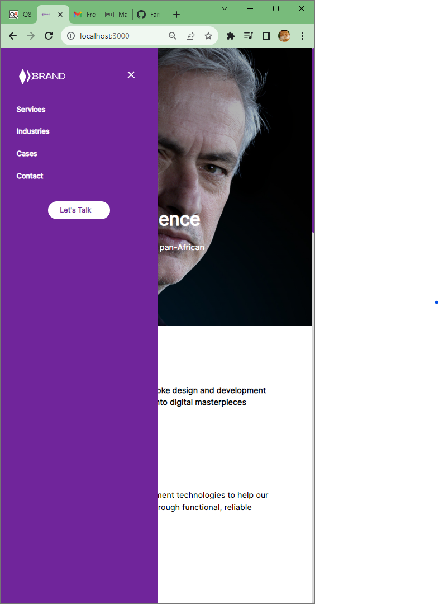
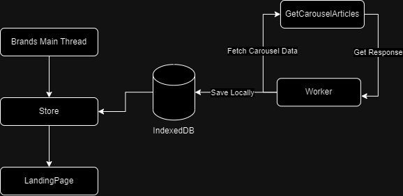

# FRONT END TEST

## The Deployed Version of the app

URL: [Front End Test](https://6527d47ab31d0c03ae059555--earnest-meerkat-5bfd0b.netlify.app/)

## Projects Screenshots

### Desktop

  

### Mobile Screens

### Instructions on how to run the project

- Make _Before you can run the project, you need to install the nodejs_

1. Firstly Pull the code

**RUN `git clone https://github.com/Fani2000/front-end_test.git && cd front-end_test`**

2. Secondly, You have to install the dependencies

**RUN `npm install`**

3. Lastly, You need to run the project

**RUN `npm run dev`**

### Here are some of the architectural designs

The overview of what the architecture looks like:

**Description:**

Since the site is mainly a static site with cases feature being the only data that you get from the aws endpoint. First I have created the worker to avoid doing the call in the main layout, and also to make sure that if the call ever returns load of data, then the site being slow won't be an issue.

So how its works is that, the worker does call using the fetch api, and then saves the information to the indexed db for persistance, the main reason is to reduce the number of requests from the api. The worker also checks if there is already information before it does the call.

In the main Brand Thread, the is liveQuery which will listen for the chances in the indexed db and then updates the store which then updates the cases carousel.

#### Improvements That could be done.

- **_Adding services workers to cache assets,files,etc_**

- **_Recycle List implementation which will only render the shown stuff in the screen_**
- **_Improving the sidebar menu rendering on mobile_**

* **Adding the Loading Spinners and also skeletons to indicate if there is an error or no data found when doing the requests**
